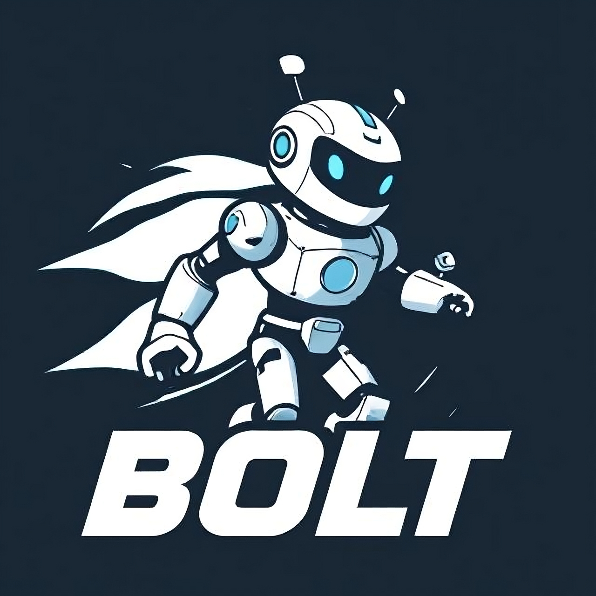

<head>
  <link href="https://fonts.googleapis.com/css2?family=Roboto:wght@400;700&display=swap" rel="stylesheet">
</head>

<h1 style="color: white; -webkit-text-stroke: 0.4px black; font-size:2.5em; padding:0; margin:'auto'; line-height: 20px">
Bolt
</h1>

<h6 style="color: white; -webkit-text-stroke: 0.4px black; font-size:0.8em; padding:0; margin:5px 15px">
a simple HTTP server written in Ruby
</h6>

